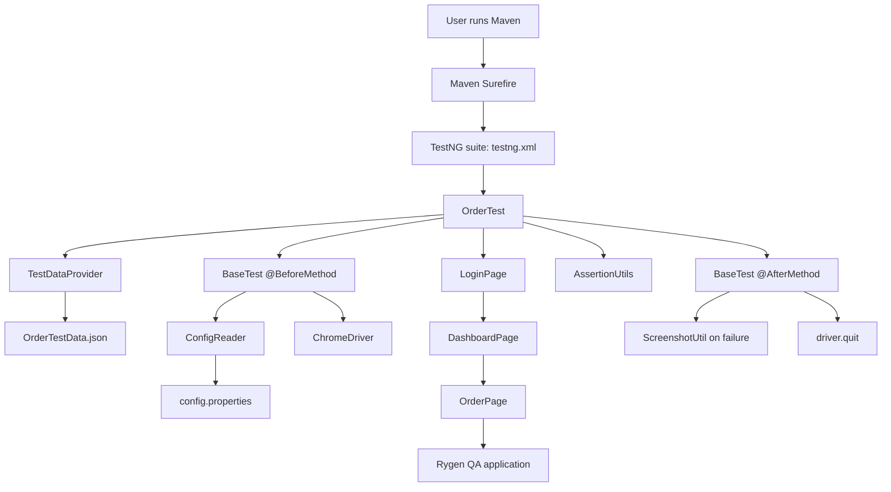
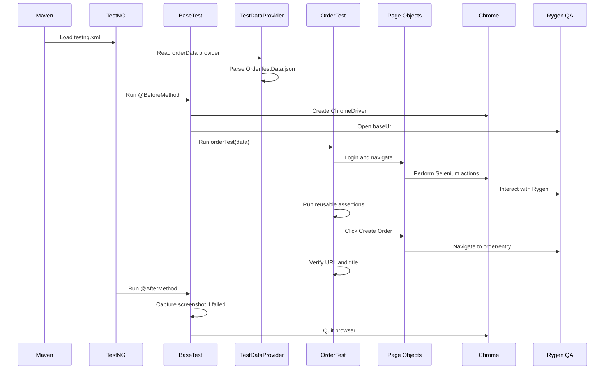

# Rygen Selenium Automation Framework

## 1. Purpose

This project is a Java-based Selenium automation framework for testing the Rygen web application at the QA environment. The current automated business flow logs into Rygen, opens the Orders area, creates a new order, fills the order form with JSON test data, validates important values, submits the order, and confirms navigation to the order-entry page.

The framework uses:

- Java 17
- Maven
- Selenium WebDriver 4.35.0
- TestNG 7.11.0
- Jackson Databind for JSON test data
- Log4j2 for execution logging
- Allure TestNG dependency for reporting integration
- Page Object Model for page actions and locators

The project is a test automation project. Its Java code is located mainly under `src/test/java`, and its configuration and test data are under `src/test/resources`.

---

## 2. High-Level Architecture

The framework is divided into five layers:

1. **Test layer**
   - Contains TestNG test classes.
   - Controls business-flow order.
   - Reads test data and calls page-object methods.
   - Performs assertions through `AssertionUtils`.

2. **Page layer**
   - Contains locators and browser actions for individual application pages.
   - Hides Selenium implementation details from test classes.

3. **Base layer**
   - Provides common browser setup, login support, screenshot capture, and cleanup.

4. **Utility layer**
   - Provides waits, configuration loading, test-data loading, assertions, and screenshots.

5. **Resource layer**
   - Contains environment configuration, JSON test data, and Log4j2 configuration.

The main relationship is:



---

## 3. Project Structure

```text
Rygen_Framework/
|
|-- pom.xml
|-- testng.xml
|-- project_documentation.md
|-- comprehensive_learning_guide.md
|-- PROJECT_GUIDE.md
|
|-- src/test/java/
|   |-- base/
|   |   `-- BaseTest.java
|   |
|   |-- pages/
|   |   |-- LoginPage.java
|   |   |-- DashboardPage.java
|   |   `-- OrderPage.java
|   |
|   |-- tests/
|   |   |-- LoginTest.java
|   |   `-- OrderTest.java
|   |
|   `-- utils/
|       |-- AssertionUtils.java
|       |-- ConfigReader.java
|       |-- ScreenshotUtil.java
|       |-- TestDataProvider.java
|       `-- WaitUtils.java
|
|-- src/test/resources/
|   |-- config.properties
|   |-- log4j2.xml
|   `-- testdata/
|       `-- OrderTestData.json
|
|-- target/
|   |-- surefire-reports/
|   `-- screenshots/
|
`-- allure-results/
```

### Important note about active tests

`testng.xml` currently enables only:

```xml
<class name="tests.OrderTest"/>
```

`tests.LoginTest` is present but commented out in the suite file. It can be enabled by uncommenting its class entry.

---

## 4. Maven Configuration

The `pom.xml` defines the project as:

- Group: `com.rygen`
- Artifact: `rygen-selenium-framework`
- Version: `1.0-SNAPSHOT`
- Java source and target: `17`

### Main dependencies

| Dependency | Version | Purpose |
|---|---:|---|
| Selenium Java | 4.35.0 | Browser automation |
| TestNG | 7.11.0 | Test execution and assertions |
| Jackson Databind | 2.20.0 | JSON parsing |
| Log4j API/Core | 2.23.1 | Structured logging |
| Allure TestNG | 2.29.1 | Allure integration dependency |

### Maven plugins

- `maven-compiler-plugin` compiles Java 17 source code.
- `maven-surefire-plugin` runs TestNG using `testng.xml`.

---

## 5. Test Execution Lifecycle

The complete lifecycle for the active order test is:



### Step 1: Maven starts TestNG

When `mvn test` runs, Maven Surefire reads the suite configured in `testng.xml`. The active suite starts `OrderTest`.

### Step 2: TestNG requests test data

`OrderTest` uses:

```java
@Test(
    dataProvider = "orderData",
    dataProviderClass = utils.TestDataProvider.class
)
```

`TestDataProvider` reads:

```text
src/test/resources/testdata/OrderTestData.json
```

Jackson converts the JSON array into `List<Map<String, Object>>`, then TestNG receives one `Map<String, Object>` per test invocation.

If more objects are added to the JSON array, the same test method runs once for each object.

### Step 3: Browser setup

Because `OrderTest` extends `BaseTest`, TestNG runs `BaseTest.setUp()` before the test:

1. Creates a `ChromeDriver`.
2. Maximizes the browser window.
3. Reads `baseUrl` through `ConfigReader`.
4. Opens the Rygen QA URL.

### Step 4: Test execution

`OrderTest` extracts values from the data map and calls page-object methods in business order. It does not directly implement most locator interaction logic.

### Step 5: Cleanup

After the test, TestNG runs `BaseTest.tearDown()`:

1. If the test failed, it captures a screenshot.
2. If a driver exists, it calls `driver.quit()`.

---

## 6. Configuration and Test Data

### `config.properties`

Location:

```text
src/test/resources/config.properties
```

Current keys:

```properties
baseUrl=https://qa.rygen.com
username=3PLAdminUser
password=3plAdmin@2026
domain=JCB
```

`BaseTest` currently uses `baseUrl` from this file. The active `OrderTest` receives username, password, and domain from JSON data rather than reading those three keys directly.

### `OrderTestData.json`

Location:

```text
src/test/resources/testdata/OrderTestData.json
```

The current JSON object contains:

- Login data: username, password, domain
- Origin data: origin, location line 2, location line 3
- Contact data: name, phone, email, company
- Pickup data: timezone, day, hour, minute, AM/PM
- Notes: internal notes and carrier instructions
- Destination data: destination
- Order data: description, handling, reference number, value of goods, billing terms

Example data shape:

```json
{
  "origin": "15 MCDONALD SACRAMENTO",
  "destination": "4-Horn Industrial",
  "pickupDay": 10,
  "pickupHour": 5,
  "pickupMinute": 0,
  "pickupAmPm": "AM",
  "referenceNumber": "12345"
}
```

### Adding another data set

Add another JSON object to the array. Do not change the test method unless the field names or data types change.

For numeric fields, the test supports JSON numbers and string representations for values such as `pickupDay`, `pickupHour`, `pickupMinute`, and `handling`.

### Security warning

Credentials are currently stored in source-controlled configuration/test-data files. For shared repositories or CI environments, move credentials to environment variables, Maven properties, a secret manager, or CI secret variables.

---

## 7. Page Object Responsibilities

### `LoginPage`

Location:

```text
src/test/java/pages/LoginPage.java
```

Responsibilities:

- Locate the username field.
- Enter the username.
- Click Continue.
- Locate and enter the password.
- Click Sign In.
- Search for and select the requested domain.
- Verify that the dashboard container is visible.

Important locators:

- Username: `id=signInName`
- Continue: `id=continue`
- Password: `id=password`
- Sign in: `id=next`
- Domain search: `input[placeholder='Search Domains']`
- Dashboard: `.dashboard-container`

`LoginPage` uses a 60-second explicit wait for login controls.

### `DashboardPage`

Location:

```text
src/test/java/pages/DashboardPage.java
```

Responsibilities:

- Verify the dashboard container is displayed.
- Click the Orders navigation item.
- Return an `OrderPage` object after navigation.

The dashboard page uses a 30-second explicit wait.

### `OrderPage`

Location:

```text
src/test/java/pages/OrderPage.java
```

Responsibilities:

- Open the New Order form.
- Handle optional domain popups.
- Enter origin and destination addresses.
- Select address suggestions.
- Enter contact and location details.
- Select timezone.
- Open and select the pickup date.
- Set pickup time.
- Select direction and billing terms.
- Enter order details and reference number.
- Click Create Order.
- Wait for the order-entry URL.

The class stores page locators privately and exposes selected locators through getter methods where `OrderTest` needs to perform reusable assertions.

---

## 8. Order Flow in Detail

The active `OrderTest` executes the following flow.

### 8.1 Login

The test calls `BaseTest.login(username, password, domain)`. That method creates a `LoginPage`, performs the login steps, selects the domain, and returns a `DashboardPage`.

### 8.2 Dashboard verification

The test verifies that the dashboard is displayed using:

```java
AssertionUtils.assertTrue(
    dashboardPage.isDashboardDisplayed(),
    "Dashboard is not displayed"
);
```

### 8.3 Open Orders and New Order

The dashboard clicks the Orders link and returns an `OrderPage`. The test then clicks New Order.

The current flow handles two possible application states:

1. A domain popup may appear and be cancelled.
2. New Order is clicked again to continue to the form.

The domain popup handling is defensive. If the popup is not visible within its short wait, execution continues.

### 8.4 Order form readiness

The test verifies that the origin address field is visible. This confirms that the New Order form is ready for interaction.

### 8.5 Origin address

`OrderPage.enterOriginAddress()`:

1. Waits for the origin field.
2. Scrolls it into view.
3. Clears the field.
4. Types the address.
5. Waits for the matching suggestion.
6. Clicks the suggestion.

The test verifies the final field value.

### 8.6 Location and contact details

The test enters:

- Location line 2
- Location line 3
- Contact name
- Contact phone
- Contact email
- Contact company

The phone field may display a mask such as `(987) 654-3210`. Therefore, the test uses `assertFieldDigitsEqual()` so punctuation and spaces do not cause a false failure.

### 8.7 Timezone

`selectTimezone()` first attempts normal UI interaction. If the option cannot be selected reliably, it uses JavaScript to assign the value and dispatch input/change events. It also closes known overlays.

The test verifies that the timezone control is not empty.

### 8.8 Pickup date and time

The pickup method is `setEarliestPickupDateTime()`.

Its actual behavior is:

1. Locate the pickup datetime input.
2. Resolve the day from JSON, or use the current day when the configured day is not positive.
3. Open the PrimeNG datepicker.
4. Wait for the datepicker panel.
5. Select the requested day cell.
6. Convert the requested hour and AM/PM to 24-hour format.
7. Build an ISO-like value such as `2026-09-10T05:00`.
8. Assign the value directly to the input with JavaScript.
9. Dispatch `input` and `change` events.
10. Close the datepicker by clicking the document body.

The datepicker is genuinely opened and a calendar day is clicked. The final datetime is also assigned directly because the PrimeNG time controls were not reliable during automation.

The test then verifies the final datetime field value.

### 8.9 Destination address

The destination flow is the same pattern as origin:

1. Type the destination.
2. Wait for the matching suggestion.
3. Click the suggestion.
4. Verify the selected field value.

### 8.10 Description and handling

The test enters the description and selects the matching suggestion. It then enters the handling quantity and verifies both field values.

### 8.11 Direction

`selectInbound()` calls the generic `selectDirection("Inbound")` method.

The method:

1. Opens the direction dropdown.
2. Locates the filter/search input.
3. Types the requested direction.
4. Finds a matching option.
5. Scrolls the option into view.
6. Clicks the option.

The test verifies that the rendered selected-label locator for `Inbound` is visible.

### 8.12 Value of goods and billing terms

The test enters the value of goods and selects the billing term.

There is intentionally no exact value assertion for Value of Goods because the application formats the input. For example, entered `1500` can be rendered as `$1,500.00` or `1500.00`.

The billing terms selected label is verified as visible.

### 8.13 Weight

The test enters `1000` into the weight field.

There is intentionally no exact string assertion because the UI formats the value as `1,000`.

### 8.14 Sales order number

The test enters the reference number. The application may display comma formatting, such as `12,345` for input `12345`.

`OrderPage.isSalesOrderNumberEntered()` removes commas and spaces from both expected and actual values before comparing them. This makes the assertion validate the number's meaning rather than its display formatting.

### 8.15 Create Order and navigation

Before clicking Create Order, the test verifies that the button exists, is displayed, and is enabled.

Then it:

1. Clicks Create Order.
2. Waits for the URL to contain `/order/entry`.
3. Verifies the URL contains `/corsair/order/entry`.
4. Verifies the title contains `New Order`.

Successful completion is logged with the final URL.

---

## 9. Wait Strategy

`WaitUtils` centralizes common explicit waits with a default timeout of 15 seconds:

- `waitForVisibility(locator)`
- `waitForClickable(locator)`
- `waitForPresence(locator)`
- `waitForVisibility(locator, timeoutInSeconds)`
- `waitForUrlContains(urlPart)`

Other page objects use direct `WebDriverWait` instances:

- Login page: 60 seconds
- Dashboard page: 30 seconds

The framework avoids fixed sleeps for normal synchronization. The active test contains a 20-second sleep after successful completion only to keep the final browser state visible temporarily; it is not needed for the order creation logic itself.

---

## 10. Safe Click and JavaScript Fallbacks

`OrderPage.safeClick()` is used for controls that may be blocked by overlays or may become stale.

Its process is:

1. Wait for element presence.
2. Scroll the element into the center of the viewport.
3. Try a normal Selenium clickable click.
4. If Selenium reports an intercepted or stale element, use JavaScript click.

JavaScript fallback is also used for:

- Create Order button
- Timezone value assignment
- Pickup datetime value assignment
- Sales order value assignment when normal typing fails

These fallbacks exist because the application uses dynamic overlays and PrimeNG controls that can interfere with normal WebDriver interaction.

---

## 11. Assertion Framework

`AssertionUtils` is the shared assertion layer used by active tests.

Current methods:

| Method | Purpose |
|---|---|
| `assertTrue` | Validate a boolean condition |
| `assertEquals` | Compare two values |
| `assertNotNull` | Validate a required object is present |
| `assertElementDisplayed` | Verify an element is displayed |
| `assertElementEnabled` | Verify an element is enabled |
| `assertElementExists` | Verify a locator resolves to an element |
| `assertElementNotEmpty` | Verify a field has content |
| `assertFieldHasValue` | Compare an input's live value/text with expected data |
| `assertFieldDigitsEqual` | Compare numeric digits while ignoring masks and punctuation |
| `assertButtonClickable` | Verify a button exists, displays, and is enabled |
| `assertLocatorVisible` | Verify a locator exists and is displayed |
| `assertFieldNotEmpty` | Verify a located field is populated |
| `assertUrlContains` | Verify the current URL contains expected text |
| `assertTitleContains` | Verify the page title contains expected text |

The utility reads live DOM properties first for input assertions. This is important because JavaScript-driven controls may update the DOM property without updating the original HTML attribute.

Assertions currently cover:

- Dashboard loaded
- Order form ready
- Origin address
- Location fields
- Contact fields
- Phone digits
- Timezone populated
- Notes and carrier instructions
- Pickup datetime
- Destination address
- Description
- Handling
- Direction control
- Billing terms control
- Sales order number
- Create Order button state
- Final URL
- Final page title

---

## 12. Screenshot Handling

`ScreenshotUtil` captures PNG screenshots in:

```text
target/screenshots/
```

Screenshots are captured automatically by `BaseTest.tearDown()` only when a TestNG test fails.

The generated filename contains:

- Timestamp
- Test class name
- Test method name

Example:

```text
20260911_095335_313_tests.OrderTest_orderTest.png
```

The screenshot directory may not exist after a fully successful run because no failure occurred. It is created automatically on the first failed test.

To verify screenshot capture safely:

1. Add a temporary failing assertion to a test.
2. Run `mvn test -q`.
3. Check `target/screenshots/` for a nonzero-size PNG.
4. Remove the temporary failing assertion.
5. Run the suite again.

Do not leave an intentional failure in committed test code.

---

## 13. Logging and Reports

The tests use Log4j2 for structured messages such as:

```text
STEP 15: Clicking Create Order
STEP 16: Current URL after Create Order: ...
STEP 17: Order test completed successfully!
```

Maven Surefire writes test execution results under:

```text
target/surefire-reports/
```

The project also contains an `allure-results/` directory and the Allure TestNG dependency. Allure report generation is not configured as a Maven plugin in the current `pom.xml`; report generation must be handled separately if required.

---

## 14. Running the Project

Run from the project root:

```powershell
mvn test -q
```

Run a clean build and test:

```powershell
mvn clean test
```

Compile without executing tests:

```powershell
mvn -q -DskipTests test
```

The browser must be available as Google Chrome. Selenium Manager normally resolves the matching driver automatically.

### Expected successful result

The log should contain a final message similar to:

```text
STEP 17: Order test completed successfully! Order created at: https://qa.rygen.com/corsair/order/entry
```

### Run LoginTest separately

`LoginTest` is not active in `testng.xml` by default. To run it through the suite, enable:

```xml
<class name="tests.LoginTest"/>
```

If both classes are enabled, TestNG will execute both tests.

---

## 15. Troubleshooting Guide

### Test fails during login

Check:

- `baseUrl` in `config.properties`
- Username, password, and domain in `OrderTestData.json`
- Network access to the QA environment
- Whether the login page locators changed
- Whether the domain popup or login flow changed

### Element click intercepted

Check for:

- PrimeNG overlay panels
- Domain dialogs
- Loading masks
- Sticky headers or footers

`OrderPage.safeClick()` already provides a JavaScript fallback, but a changed locator may still require maintenance.

### Datepicker or time value fails

Check:

- The pickup input ID: `stop-1-content-earliest-PICKUP`
- The datepicker panel class: `p-datepicker-panel`
- The day-cell classes and `aria-label` values
- The browser's current date and timezone
- The JSON day, hour, minute, and AM/PM values

The current implementation selects the calendar day through the UI and assigns the final date/time value directly to the datetime input because the PrimeNG time widget is not stable under repeated automation clicks.

### Formatted field assertion fails

Some application inputs format their values:

- Phone: `(987) 654-3210`
- Weight: `1,000`
- Value of goods: `$1,500.00`
- Sales order: `12,345`

Use a formatting-aware assertion strategy for these fields. The active test currently normalizes phone digits and sales-order commas and intentionally avoids exact string assertions for weight and value-of-goods.

### Screenshot is missing

Screenshots are failure-only. Confirm that:

- The test actually failed.
- `driver` was not null.
- The browser supports `TakesScreenshot`.
- The command was run from the project root.
- `target/screenshots/` was checked after execution.

### CDP warning

Selenium may log a warning when the Chrome browser version is newer than the Selenium DevTools module bundled in the current Selenium release. The browser test can still pass, as it currently does. If DevTools-specific features are needed, align Selenium and Chrome versions or add the matching Selenium DevTools artifact.

---

## 16. Maintenance Rules

When the application changes:

1. Update locators in the relevant page object.
2. Keep business-flow order in the test class.
3. Keep reusable waits in `WaitUtils` or the relevant page object.
4. Keep assertions in `AssertionUtils`.
5. Keep test values in JSON rather than hardcoding them in the test.
6. Re-run `mvn test -q` after changes.
7. Check `target/surefire-reports/` after failures.
8. Open the generated screenshot when a failure occurs.

When adding a new order data set:

1. Add another object to `OrderTestData.json`.
2. Keep property names consistent.
3. Confirm values match the application's current suggestions and dropdown options.
4. Run the suite and review the log for the data set that failed.

When adding a new page:

1. Create a page object under `src/test/java/pages`.
2. Keep locators private.
3. Add explicit wait-based actions.
4. Return the next page object where navigation occurs.
5. Add test-facing verification methods or locator getters only where needed.

---

## 17. Current Limitations and Risks

- Credentials are stored in plain text in test resources.
- The test targets a live QA environment, so availability and data state can affect results.
- The active suite contains one order data set.
- LoginTest is disabled in `testng.xml`.
- Some controls require JavaScript fallback because of dynamic PrimeNG overlays.
- The final 20-second sleep in `OrderTest` slows execution and is intended only for observation.
- The code contains a large legacy commented block at the end of `OrderTest`; it is not executed and can be removed after confirming it is no longer needed.
- Allure dependency is present, but a complete report-generation command/plugin is not defined in `pom.xml`.
- Selenium may report a CDP version warning when Chrome and Selenium DevTools versions do not match exactly.

---

## 18. One-Paragraph Summary

When the project is run, Maven starts the TestNG suite, TestNG loads order data from JSON, `BaseTest` opens Chrome and navigates to the configured Rygen QA URL, and `OrderTest` uses `LoginPage`, `DashboardPage`, and `OrderPage` to log in and create an order. `WaitUtils` synchronizes browser actions, `safeClick` and JavaScript fallbacks handle dynamic overlays, `AssertionUtils` validates the form and final navigation, Log4j2 records the execution, and `BaseTest` captures a screenshot on failure before closing the browser. The design keeps data, page behavior, test flow, and reusable utilities separated so the framework can be extended with additional order data and tests.
