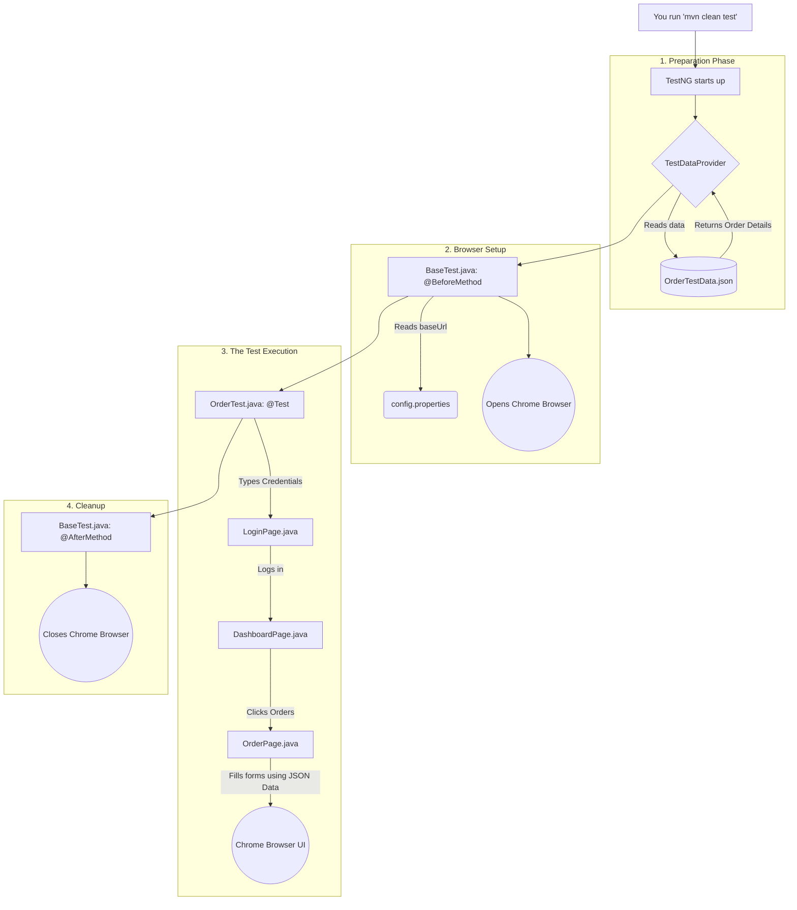

# From Zero to Pro: Understanding the Rygen Automation Framework

If you have zero background in automation or coding, don't worry. This guide is built to take you from a complete beginner to a confident professional who understands exactly what this project does and how it does it.

---

## Part 1: Core Testing Concepts (The "Why")

Before looking at the code, you need to understand the concepts we are using to test the application.

### 1. Manual Testing vs. Automated Testing
*   **Manual Testing:** A human sits at a computer, clicks buttons, types in fields, and looks at the screen to make sure the website works. It is slow and boring.
*   **Automated Testing:** We write a script (a set of instructions) that controls a "robot" to do the clicking and typing for us at superhuman speed. This project is the robot.

### 2. Selenium WebDriver
**What is it?** Selenium is a free library of code that acts as a remote control for web browsers (like Google Chrome).
**How we use it:** Whenever our code says `driver.get("url")` or `element.click()`, Selenium translates that Java code into a real physical action inside the Chrome browser.

### 3. TestNG (Test Next Generation)
**What is it?** It is a testing framework for Java. If Selenium is the remote control, TestNG is the director telling the remote control *when* to press buttons.
**How we use it:** It uses "Annotations" (words starting with `@`) like `@Test` to mark a piece of code as a test, or `@BeforeMethod` to say "Do this before every test starts" (like opening the browser).

### 4. Page Object Model (POM)
**What is it?** This is the most important concept in the industry. Instead of writing one massive, confusing script, we separate the code. We create a "Blueprint" (a Java Class) for every single page in the web app.
**How we use it:** 
*   We have a `LoginPage` class that *only* knows about login buttons and password fields.
*   We have an `OrderPage` class that *only* knows about order forms. 
If the Rygen developers move the login button tomorrow, we don't have to search through 1,000 lines of test code; we just update the `LoginPage` class.

### 5. Data-Driven Testing (DDT)
**What is it?** Instead of hardcoding "John Doe" into our code, we keep our data outside the code in a separate file (like a JSON or Excel file).
**How we use it:** Our code reads `OrderTestData.json` and runs the test. If we want to test 10 different addresses, we don't write 10 tests. We just add 10 addresses to the JSON file, and the same test automatically runs 10 times!

---

## Part 2: The Execution Flow (The Visuals)

Here is a visual map of exactly what happens when you run the project.



---

## Part 3: Breaking Down the Code (The "How")

Let's look at the actual code in the project and explain it simply.

### 1. `pom.xml` (The Shopping List)
Think of Maven as a personal shopper. The `pom.xml` file is your shopping list. You write down that you need "Selenium", "TestNG", and "Log4j2". When you run the project, Maven goes to the internet, downloads these tools, and brings them to your project so you can use them.

### 2. `utils/ConfigReader.java` (The Settings Manager)
**The Concept:** You never want to hardcode URLs (like `qa.rygen.com`) directly in your test. If the URL changes, you'd have to find and replace it everywhere.
**The Code:**
```java
// We load a file called config.properties
FileInputStream input = new FileInputStream("src/test/resources/config.properties");
properties.load(input);

// Now, anywhere in our code, we can just ask for the URL!
String url = ConfigReader.getProperty("baseUrl");
```

### 3. `base/BaseTest.java` (The Wrapper)
**The Concept:** Every test needs to open a browser at the start and close it at the end. We put this in `BaseTest` so all other tests can just inherit it without writing it again.
**The Code:**
```java
// @BeforeMethod runs before the test starts
@BeforeMethod
public void setUp() {
    driver = new ChromeDriver(); // Opens Google Chrome
    driver.manage().window().maximize(); // Makes it full screen
    driver.get(ConfigReader.getProperty("baseUrl")); // Goes to Rygen URL
}

// @AfterMethod runs when the test is completely done
@AfterMethod
public void tearDown() {
    driver.quit(); // Kills the browser so it doesn't drain computer memory
}
```

### 4. `pages/OrderPage.java` (The Page Blueprint)
**The Concept:** This is the Page Object Model in action. This class stores the "address" (XPath locators) of elements on the screen, and the actions you can perform on them.
**The Code:**
```java
// 1. Locate the exact element on the screen using its ID
By contactName = By.id("stop-1-content-contact-contact-name");

// 2. Create a method to type into that specific element
public void enterContactName(String value) {
    // Wait until the element is actually visible on the screen
    WebElement element = wait.until(ExpectedConditions.visibilityOfElementLocated(contactName));
    element.clear(); // Erase any old text
    element.sendKeys(value); // Type the new name
}
```
**The Pro-Level Trick (`safeClick`):** 
Sometimes modern websites have floating footers or loading spinners that visually cover the button we want to click. If Selenium tries to click it normally, it hits the footer instead and crashes with an `ElementClickInterceptedException`. 
To fix this, we wrote `safeClick()`. It catches the crash, and falls back to a "JavaScript Click". JavaScript doesn't care if an element is visually covered; it bypasses the screen and clicks the element directly in the HTML code!

### 5. `tests/OrderTest.java` (The Script)
**The Concept:** This is where the story actually plays out. It takes the data, uses the Page Objects, and performs the test.
**The Code:**
```java
// We tell TestNG to use the dataProvider to fetch data from our JSON file
@Test(dataProvider = "orderData", dataProviderClass = utils.TestDataProvider.class)
public void orderTest(java.util.Map<String, Object> data) {
    
    // 1. Extract the data from the JSON map
    String destination = (String) data.get("destination");
    
    // 2. Use our Page Objects to do the work!
    logger.info("STEP 1: Starting login");
    DashboardPage dashboardPage = login(username, password, domain);
    
    logger.info("STEP 7: Clicking New Order");
    orderPage.clickNewOrder();
    
    logger.info("STEP 12: Entering Destination Address");
    orderPage.enterDestinationAddress(destination);
}
```

## Summary
You are now looking at a professional, enterprise-grade automation framework. It reads external JSON data, uses reusable Page Objects, handles setup and teardown automatically via TestNG, protects against UI glitches with JavaScript fallbacks, and logs everything clearly. You went from zero to pro!
